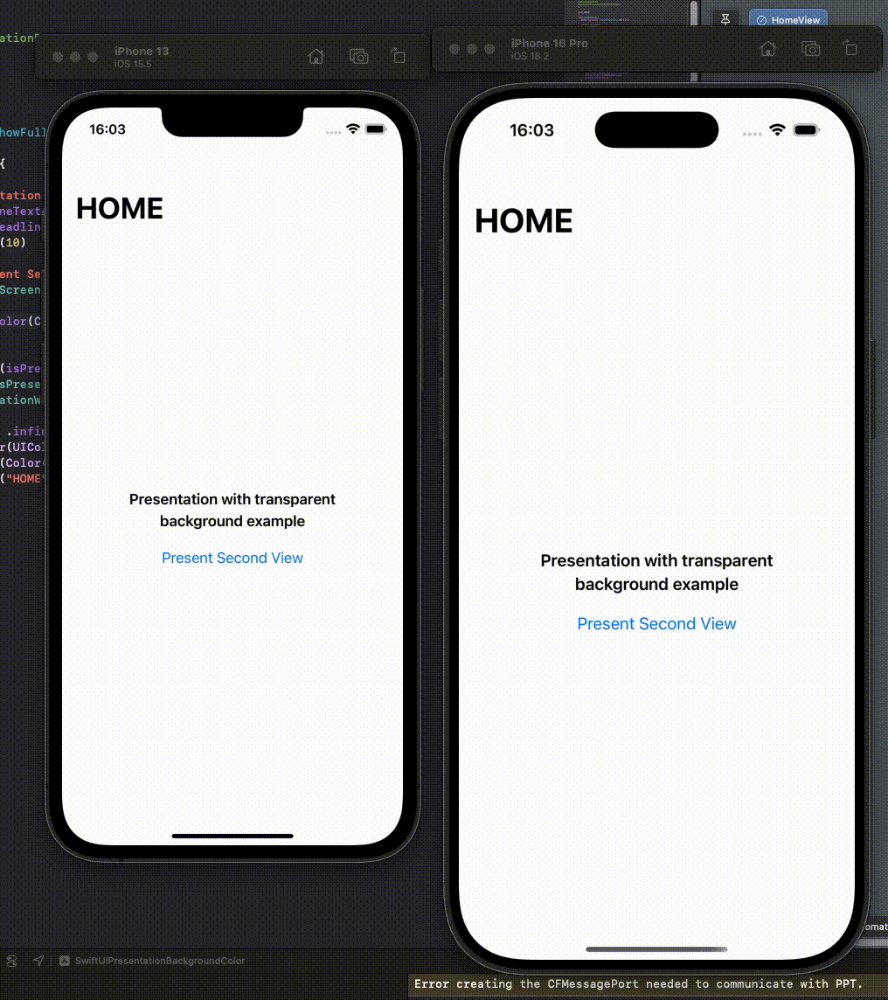

# 🎨 SwiftUI Presentation Background Color Customization (iOS 15+)

This repository demonstrates how to **customize the background color of presentation views** in **SwiftUI**, specifically targeting **iOS 15 and above**. It includes a clean example of using UIKit interoperability to override SwiftUI’s default presentation styling.

> 📝 Accompanying article: [How to Customize the Presentation Background in SwiftUI (iOS 15+)](https://medium.com/@tungvt.it.01/how-to-customize-the-presentation-background-in-swiftui-ios-15-93ff4e532a5d)

## ✨ Features

- Customize modal sheet background color in SwiftUI
- Integrates UIKit’s `UIViewControllerRepresentable` for advanced customization
- iOS 15+ compatible solution
- Minimal, easy-to-understand SwiftUI code

## 📸 Preview




## 🧩 How It Works

SwiftUI doesn’t directly expose APIs to modify the presentation background color. This example uses a custom `UIViewControllerRepresentable` to wrap a UIKit view controller that:

- Applies a background color to the presentation container
- Preserves SwiftUI-style data flow

For a complete explanation, read the full article [here](https://medium.com/@tungvt.it.01/how-to-customize-the-presentation-background-in-swiftui-ios-15-93ff4e532a5d).

## 📦 Requirements

- Xcode 13+
- iOS 15+
- Swift 5.5+

## 🚀 Getting Started

1. Clone the repository:
   ```bash
   git clone https://github.com/tungvt-it-92/swiftui-presentation-background-color.git
   cd swiftui-presentation-background-color
   ```

2. Open the project in Xcode and run it on an iOS 15+ simulator or device.

## 📂 Structure

- `ContentView.swift`: SwiftUI entry point
- `CustomPresentationModifier.swift`: SwiftUI-friendly modifier to trigger the custom presentation
